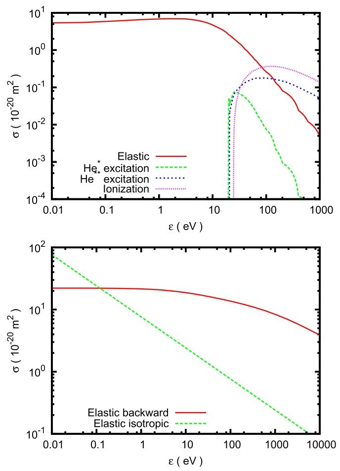
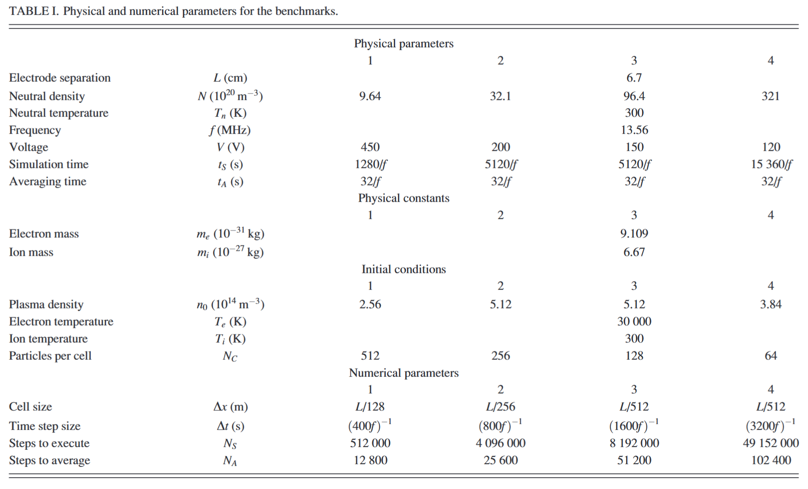

### 基准测试设置完整总结
本文为一维平行板射频容性耦合氦气放电的粒子网格/蒙特卡洛碰撞（PIC/MCC）基准测试，所有设置均严格统一约束，用于校验不同独立代码的计算一致性与数值误差。

---

#### 一、物理模型与基准算例
1.  **几何模型**：一维笛卡尔坐标系，两块平行平板电极垂直于x轴，电极间隙为计算域。
2.  **工质参数**：放电气体为氦气，气体温度恒定300 K，密度与压强不随空间、时间变化；共设置4组基准算例，压强覆盖可稳定放电的常规区间：压强低于下限无法维持放电，高于上限时碰撞过强，传统PIC方法适用性下降。
3.  **驱动条件**：电极间施加13.56 MHz正弦交变电压，相位约定为t=0时刻电压为0；4组算例采用不同电压幅值，调整目标为使所有算例的电流密度幅值均约为10 A·m⁻²。
4.  **物理常数**：全部基础常数采用2006版CODATA数值，计算精度至少保留四位小数。

---

#### 二、边界条件
##### 1. 电势与电场边界
采用**第一类Dirichlet边界条件**：
- 两端电极作为计算域边界，电势为给定值；标准实现为一侧电极接地（电势恒为0），另一侧电极施加时变射频驱动电势，极间电压随时间正弦变化。
- 电场由电势的空间差分求解，全程无周期边界、零电场通量等其他边界形式。

##### 2. 粒子边界
- 所有抵达电极表面的带电粒子（电子、离子）被电极完全吸收；
- 无任何二次粒子发射（无离子诱导二次电子、无电子反射），鞘层电场完全由正离子空间电荷主导。

---

#### 三、网格与数值离散设置
1.  **空间网格**：均匀结构化网格，采用有限差分法求解泊松方程，空间精度为二阶。
2.  **时间积分**：粒子运动采用显式蛙跳（leap-frog）格式推进，时间步长精度为二阶。
3.  **粒子-网格映射**：所有代码均采用双线性权重，实现网格物理量到粒子位置、粒子物理量到网格节点的双向插值。
4.  **核心数值精度约束**
    - 等离子体频率约束：$\omega_p \Delta t \leq 0.2$，保证等离子体振荡数值稳定；
    - 德拜长度约束：$\lambda_D / \Delta x \geq 2$，保证空间电荷与鞘层电场可被正确分辨；
    - 电子热运动约束：两条件联立可得 $\frac{\Delta t}{\Delta x} \sqrt{\frac{k_B T_e}{m_e}} \lesssim 0.4$，保证单时间步内热电子位移远小于单个网格宽度。
5.  **粒子权重**：控制超粒子与真实物理粒子的数量比值，各代码定义不统一，但由表1参数可间接确定对应取值；无通用选取经验公式，本次参数经试算后保守选取。
6.  **加密验证方案**：采用参数加密策略评估数值误差：每轮加密将时间步长、网格尺寸减半；最高精度算例将步长与网格缩减至基准算例的1/4，粒子数量提升16倍，计算开销约为基准算例的64倍，数值不确定度较基准算例降低约一个数量级。

---

#### 四、碰撞处理方案
1.  **算法框架**：采用经典零碰撞（Null Collision）蒙特卡洛碰撞方法，每个时间步对所有粒子执行一次碰撞判定。
2.  **零碰撞方法**：引入虚拟碰撞过程，使每种粒子的总碰撞频率$\nu_{e,i}$为恒定值；单时间步碰撞概率为 $P_{e,i}=1-\exp(-\nu_{e,i}\Delta t)\approx \nu_{e,i}\Delta t$；判定粒子发生碰撞后，再通过第二轮蒙特卡洛抽样确定具体碰撞类型。
3.  **碰撞约束**：单个粒子每个时间步最多发生一次碰撞，因此要求满足 $\nu_{e,i}\Delta t \ll 1$。
4.  **碰撞截面处理**
    - 电子、离子碰撞截面均整理为质心系能量的表格数据；
    - 区间内数值采用线性插值获取；能量超出表格最大值时，直接取表格最后一组截面数值；
    - 完整截面数据作为论文电子补充材料公开。

---

#### 五、基准运行与输出规则
1.  **运行流程**：按表1参数初始化仿真，完成指定时长的时间迭代后，取计算末期的一段子区间做时间统计平均，平均值即为基准结果。
2.  **核心基准量**：选取离子密度空间分布作为首要基准结果，原因是该物理量定义无歧义，且对数值误差与代码实现细节高度敏感。

---

#### 六、代码实现统一规则
1.  5套参与对比的代码均采用上述基础PIC/MCC算法，均未引入子循环等会增加额外数值参数、扩大实现差异的复杂技术。
2.  所有代码为独立开发，基准测试开展前各开发人员无沟通，代码在编程语言、数据结构、适配硬件架构等细节上存在差异。
3.  测试过程中发现的细微实现缺陷、伪随机数生成器问题均已修正。